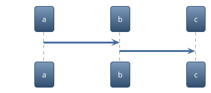

# 发布 Electron 应用

使用了原生 SDK 的 Electron 应用在发布时需要将原生应用所依赖的动态库、资源文件等文件打包到应用中。以下使用 `electron-builder` 工具包举例来描述简单的打包方式和更细颗粒度的控制打包流程。

## 简单打包

通常情况下，如果您对应用体积和目录结构没有特殊要求，使用简单打包即可满足您的需求。您只需要在 `package.json` 中声明不打包 SDK 的二进制文件即可：

```diff
"build": {
    "productName": "NIMDemo",
    "appId": "com.example.yourapp",
+    "asarUnpack": [
+      "node_modules/node-nim/build/Release"
+    ]
  }
```

## 进阶打包


